# Secure File Chat Application - Comprehensive Flow & Architecture Documentation

## 📊 Application Architecture Overview

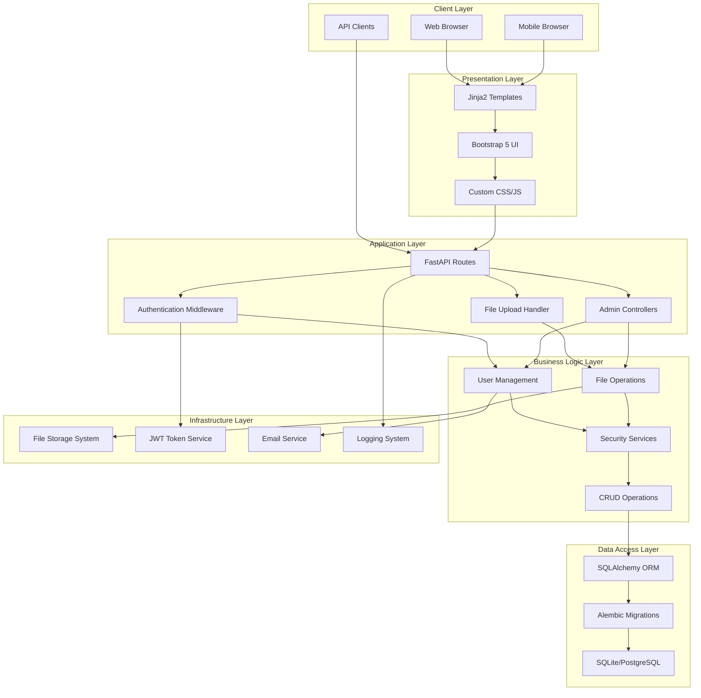

## 🔄 Detailed Application Flow Diagrams

### 1. User Lifecycle Flow

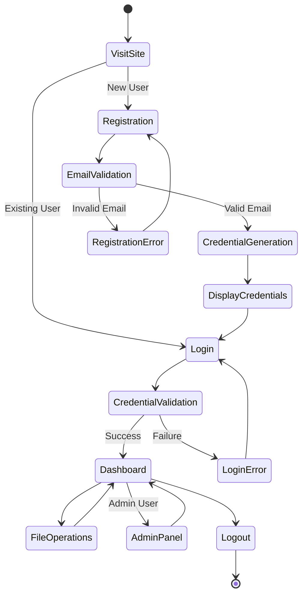

### 2. File Upload & Sharing Flow

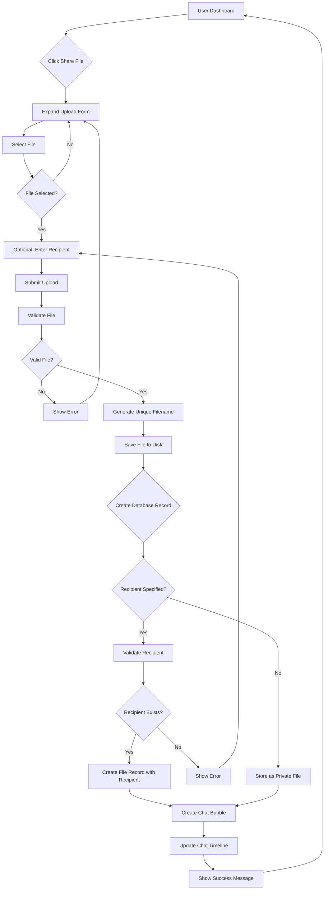

### 3. File Download Flow

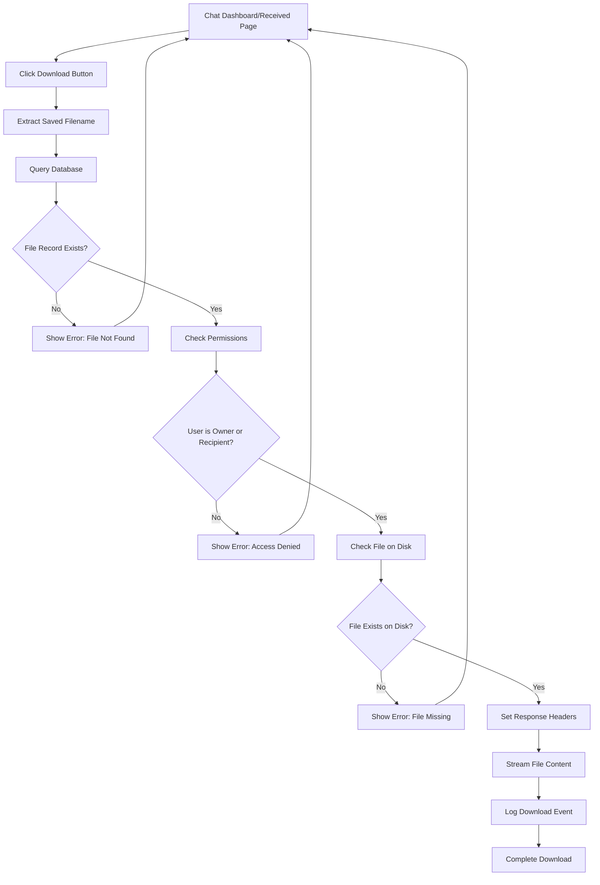

### 4. Authentication & Authorization Flow

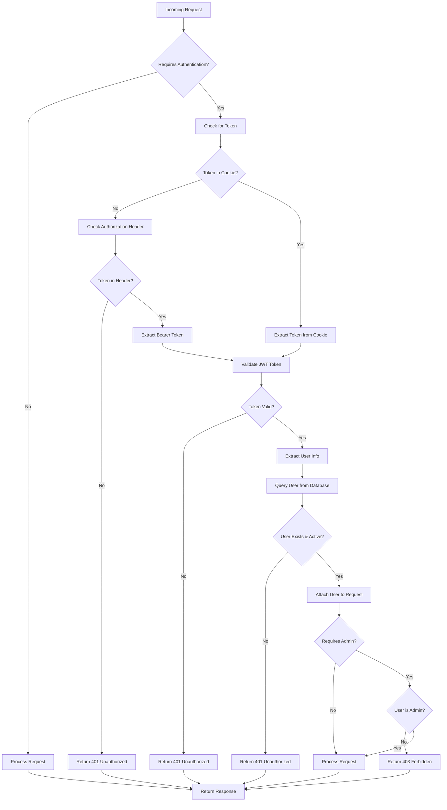

## 🗂️ Database Schema & Relationships

### Complete Entity-Relationship Diagram

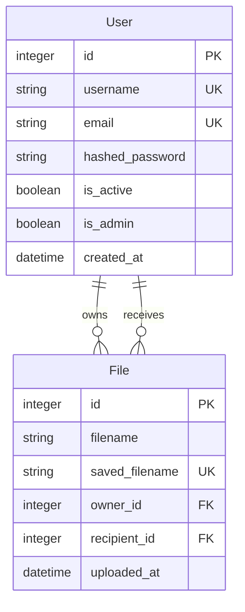

### Database Migration Strategy

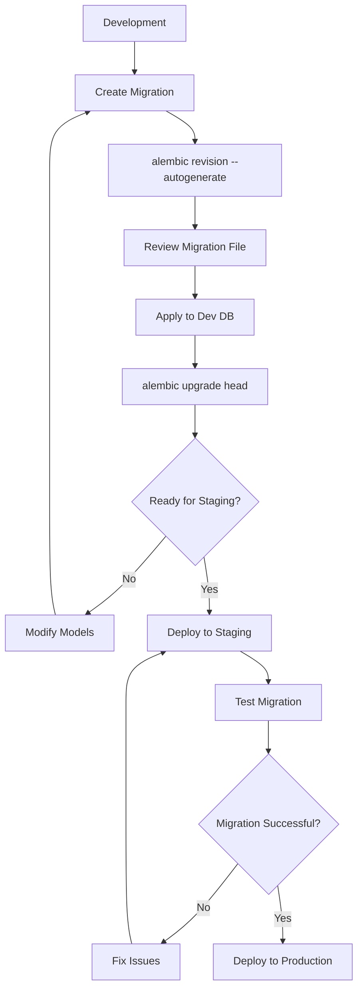

## 🔐 Security Architecture

### Authentication Flow

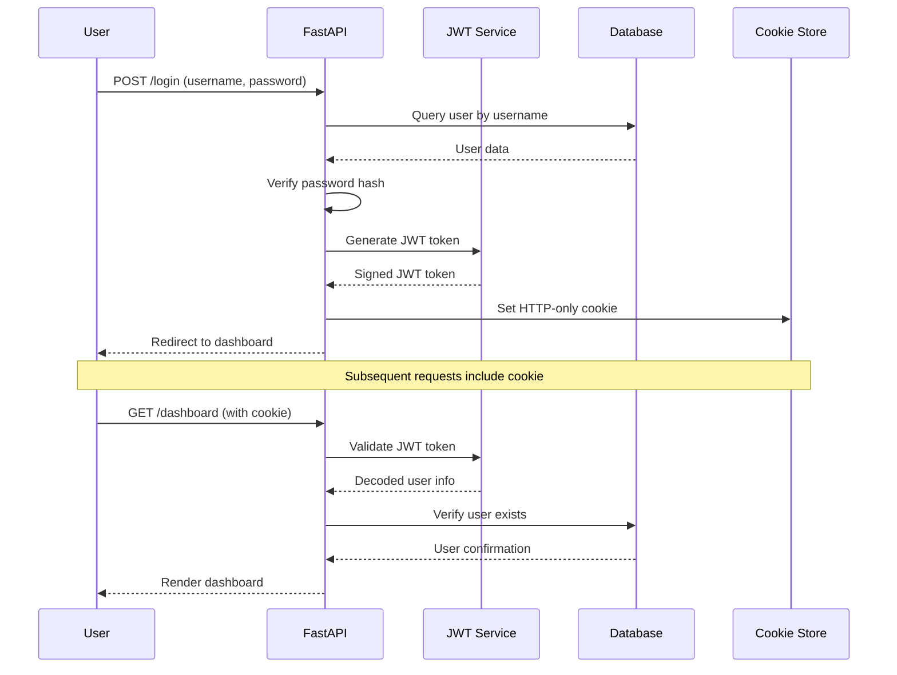

### File Security Flow

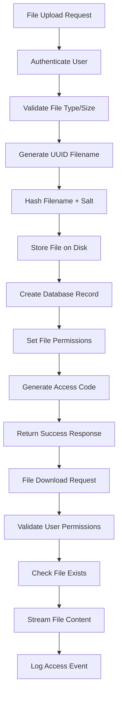

## 🚀 Deployment & Infrastructure

### Production Architecture

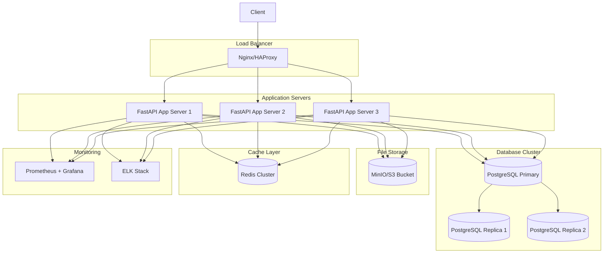

### CI/CD Pipeline

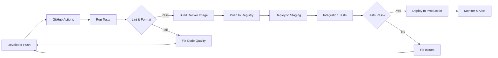

## 📈 Performance & Scalability

### Performance Monitoring Dashboard

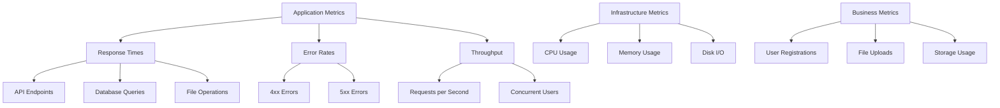

### Caching Strategy

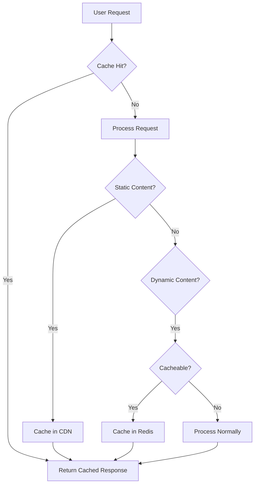

## 🔧 Maintenance & Operations

### Backup & Recovery Flow

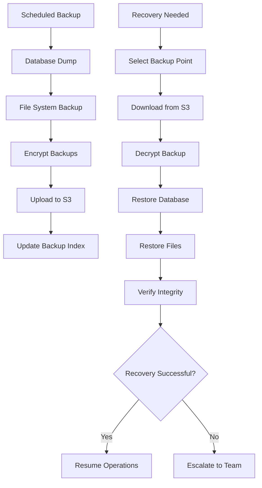

### Incident Response Flow

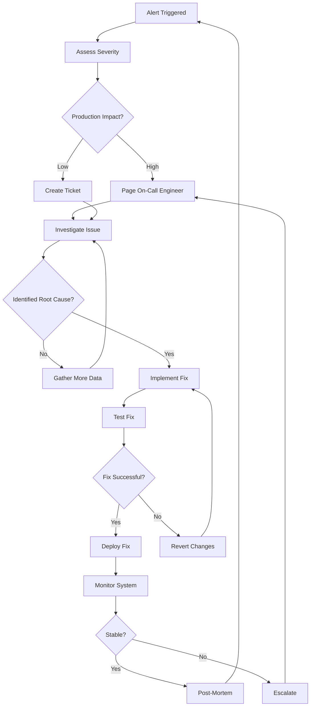

## 🎯 Future Enhancement Roadmap

### Phase 1: Enhanced User Experience (Q1 2024)

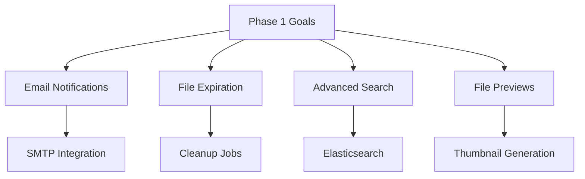

### Phase 2: Advanced Features (Q2 2024)

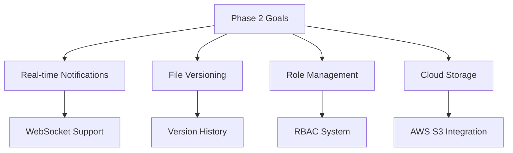

### Phase 3: Enterprise Features (Q3 2024)

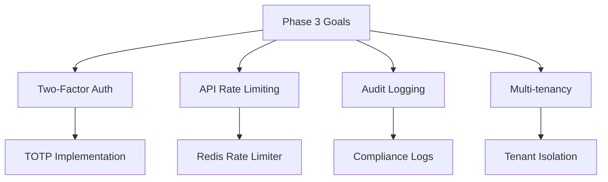

### Phase 4: Ecosystem Expansion (Q4 2024)

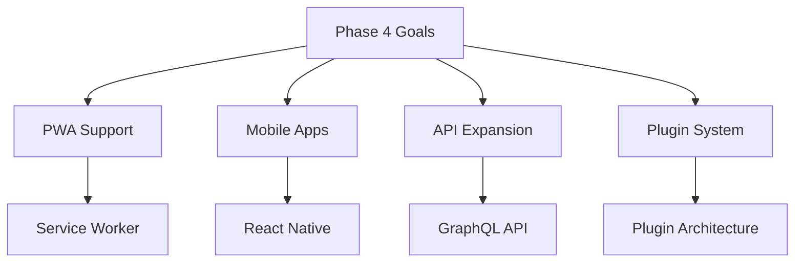

This comprehensive documentation provides detailed insights into the application's architecture, flows, security measures, and future development plans. The diagrams and explanations serve as a complete reference for understanding, maintaining, and extending the Secure File Chat Application.
